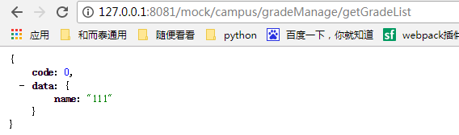
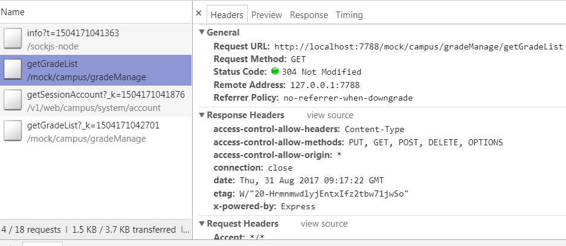
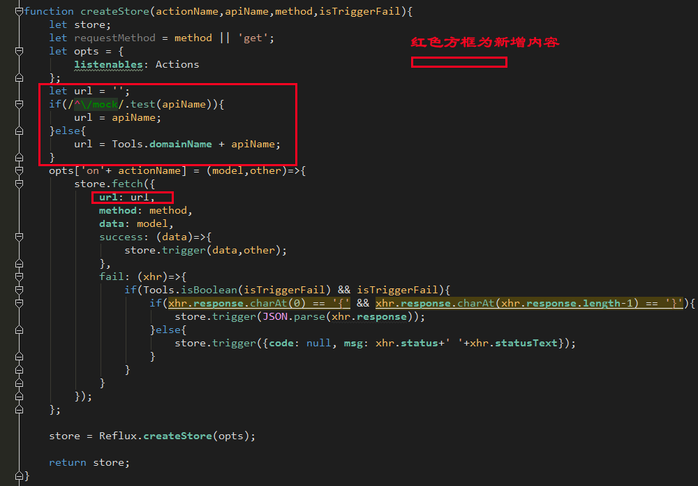

# 马哥的代码之美 #

这个仓库主要为了记录马哥的框架的学习笔记和心得，放在公网git公网的因为公司项目原因，只上传了部分配置，略作说明，只看代码，不跑项目；

私人的仓库里有放全部的项目版本，公司内部前端同事可以要地址，一起研究维护，写马哥框架的研读笔记。

## 对啦对啦，我们公司内网的gitlab地址是多少？如果还没，可不可以搭建一个?如果有就直接留言在帖子下面把！QAQ~~ ##

  	目录

- 项目初始说明
- 从马哥代码中学到的东西
- webpack.config变化，自动刷新
- 增加mock说明
- 未完篇章

## 项目初始说明：  ##

账号密码：campusAdmin  123456

本地启动服务：     npm run swpkl
    
本地打包部署：     npm run swpkd

本地预发布/测试     npm run swpkp

## 从马哥代码中学到的东西 ##

看马哥的框架，感觉就是：舒服、学习到东西、惊叹、还有很多看不懂（可以学习很久），以下是记录从其中学习到的自己以前不会的：
  
1. 直接构建了本地开发、测试、预发布/正式环境   三个版本的NPM自动化构建程度极高;    
2. webpack.optimize.CommonsChunkPlugin多页面分离资源引用,抽出了公共的一些js模块，优化加载速度;  
3. OccurrenceOrderPlugin根据模块调用次数，给模块分配ids，常被调用的ids分配更短的id，使得ids可预测，降低文件大小;  
4. router的写法，抽离出一个个小路由的写法，方便多人协作开发，和页面要出现哪些组件，站在了公司层面的战略角度，构建框架;
5. htmlWebpackPlugin一起设置了项目的关键词等核心信息；  
6. createStore模块化了一个个组件；  
7. .....................................................

## webpack.config变化，自动刷新： ##
[webpack.config改变则，自动刷新](http://www.cnblogs.com/stoneniqiu/p/6444960.html)  
>记录版本：v1.0.0
  
1、确定安装了，如下：  
  
	`npm install webpack-dev-server --save-dev`  

2、运行命令：  
  
	`nodemon --watch webpack.config.js --exec \"webpack-dev-server --env development\`  
  
3、应对本项目修改如下:  
  
>相关文件：./package.json  
  
	"dev": "nodemon --watch webpack.config.school.location.quick.js --exec \"webpack-dev-server --host 0.0.0.0 --config ./webpack.config.school.location.quick.js --progress --colors --watch\"",  
      
    
## 增加mock说明 ##
>记录版本：v1.0.0  
    
### 一、先模拟一个接口 ###
>相关文件：./mock/test/index.js  
  
文件代码如下： 
  
----
	const http = require('http');  
	const express = require('express');
	const app = express();
	const server  =   http.createServer(app);
      server.listen(8081);
	const apiRouter = express.Router();
	apiRouter.all('/campus/gradeManage/getGradeList',function (req, res){
    	    res.json({
    	        code: 0,
    	        data: {
                name:'111'
    	        }
    	    })
	});
	app.use('/mock',function(req, res, next) {
	    res.header("Access-Control-Allow-Origin", "*");
	    res.header('Access-Control-Allow-Methods', 'PUT, GET, POST, DELETE, OPTIONS');
	    res.header("Access-Control-Allow-Headers", "X-Requested-With");
	    res.header('Access-Control-Allow-Headers', 'Content-Type');
	    next();
	},apiRouter);
	console.log('模拟数据成功');

可通过  `node ./mock/test`  启动，更建议在 ./package.json 的script中配置上：  
	
	"scripts": {
		...
		"npm run mock":"node ./mock/test"
		...
	}
然后，通过  `npm run mock`  启动；  
启动成功后，打开网址：`http://127.0.0.1:8081/mock/campus/gradeManage/getGradeList`，会看到如下结果：  
  
  
  
### 二、一个简单的fetch示例 ###
>相关文件：./school/routes/main/routes/vision/components/Vision.jsx  
  
	require('es6-promise').polyfill();
	require('isomorphic-fetch');
	
	let myHeaders = new Headers({
	    'Access-Control-Allow-Origin': '*',
	    'Content-Type': 'text/plain'
	});
	
	fetch('http://127.0.0.1:8081/mock/campus/gradeManage/getGradeList').then(function(response) {
	        if (response.status >= 400) {
	            throw new Error("Bad response from server");
	        }
	        return response.json();
	    })
	    .then(function(stories) {
	        console.log(stories);
	    });

访问这个网址：`http://localhost:7788/#/main/vision/list` 应当会看到这个请求成功的显示：

  
  

### 三、马哥的代码接口网址写哪？ ###

>相关文件：./school/components/fetchData.js

第481行，改成如下，写上我们自己mock的网址：
  
	Stores.getclassRoomId = createStore('GetclassRoomId', '/mock/campus/classRoomManage/getclassRoomId');

第82-117行，改成如下所示：  
  
	function createStore(actionName,apiName,method,isTriggerFail){
	    let store;
	    let requestMethod = method || 'get';
	    let opts = {
	        listenables: Actions
	    };
	    let url = '';
	    if(/^\/mock/.test(apiName)){
	        url = apiName;
	    }else{
	        url = Tools.domainName + apiName;
	    }
	    opts['on'+ actionName] = (model,other)=>{
	        store.fetch({
	            url: url,
	            method: method,
	            data: model,
	            success: (data)=>{
	                store.trigger(data,other);
	            },
	            fail: (xhr)=>{
	                if(Tools.isBoolean(isTriggerFail) && isTriggerFail){
	                    if(xhr.response.charAt(0) == '{' && xhr.response.charAt(xhr.response.length-1) == '}'){
	                        store.trigger(JSON.parse(xhr.response));
	                    }else{
	                        store.trigger({code: null, msg: xhr.status+' '+xhr.statusText});
	                    }
	                }
	            }
	        });
	    };
	
	    store = Reflux.createStore(opts);
	
	    return store;
	}
  
主要增加修改的如下图，红线所示，以起到区分mock数据和真实接口应该如何分别处理：

### 四、解决跨域  ###
  
>相关文件：./webpack.config.school.location.quick.js

在第103-106行  增加反向代理，代码如下：  
  
    devServer: {
        ...
        proxy: {
            ...
            "/mock": {
                target:"http://127.0.0.1:8081/",
                secure:false
            }
        }
    }

## 未完篇章 ##

马哥的代码太耀眼，暂时只看了这一点，还有很多没理解，需要慢慢学习。